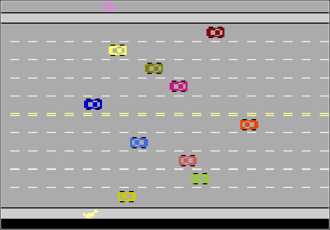

# marvellousfreewayclone

Versão online para jogar: <a href="https://joaopasantos.github.io/marvellousfreewayclone/" title="marvellousfreewayclone Github.io page">marvellousfreewayclone</a> 

**P.S.:** O console apresentará algumas mensagens de erro referentes à execução do jogo. Isso se dá por um problema na *library* <a href="https://p5js.org/" title="p5.js Homepage">p5.js</a>, que foi documentado nessa *thread* <a href="https://github.com/processing/p5.js-sound/issues/506#issue-672976731" title="p5.js Issue#506">p5.js Issue#506</a>. Apesar dessas mensagens o jogo e os sons funcionam corretamente.  

## Objetivo
Esse projeto faz parte do curso "Jogos Clássicos - Parte 2" da formação "Iniciante em Programação" da Alura.  
O objetivo era fazer um jogo similar ao clássico jogo Freeway. Seguindo os passos do curso era possível chegar em uma versão que só tinha a essência do jogo original. Tentei fazer algumas modificações e melhorias pra chegar o mais próximo do jogo original.  

## Considerações Finais
Me diverti bastante com esse projeto e foi bem útil para relembrar e fixar alguns conceitos de Git e de JavaScript, já que faz algum tempo desde que fiz a primeira versão.

### *Librarys*
- <a href="https://p5js.org/" title="p5.js Homepage">p5.js</a>
    - <a href="https://github.com/bmoren/p5.collide2D" title="p5.collide2D Github page">p5.collide2D</a>